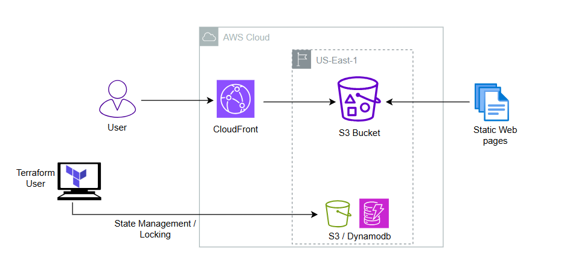

# cloudfront-s3-static-site


## Project Design




## Usage - Example tfvars

```bash
######################## Bucket Configuration ######################################
bucket_name = "tf-challenge-bucket-site"
```

## Deploy

1. Navigate to the `backend-launch` directory and run the following commands to initialize and deploy the backend resources (S3 and DynamoDB):
   ```bash
   terraform init
   terraform apply
   ```
2. Navigate to the `envs/dev` directory and execute the following commands:
    ```bash
    terraform init
    terraform plan -var-file={name}.tfvars
    terraform apply -var-file={name}.tfvars
    ```

## Destroy
1. In the same `envs/dev` directory, run the following command to tear down resources.
    ```bash
    terraform destroy -var-file={name}.tfvars
    ```
